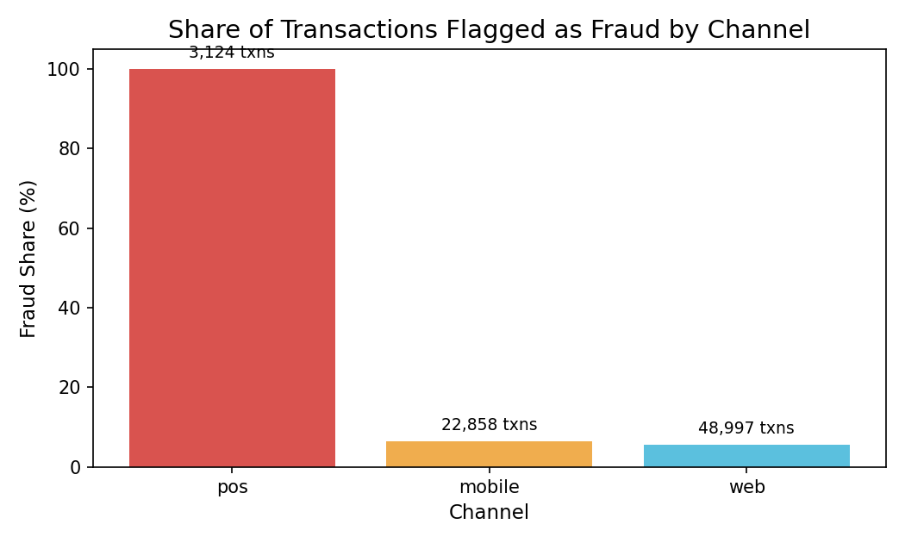
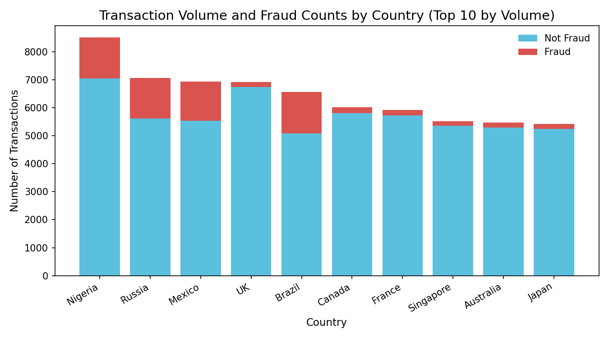
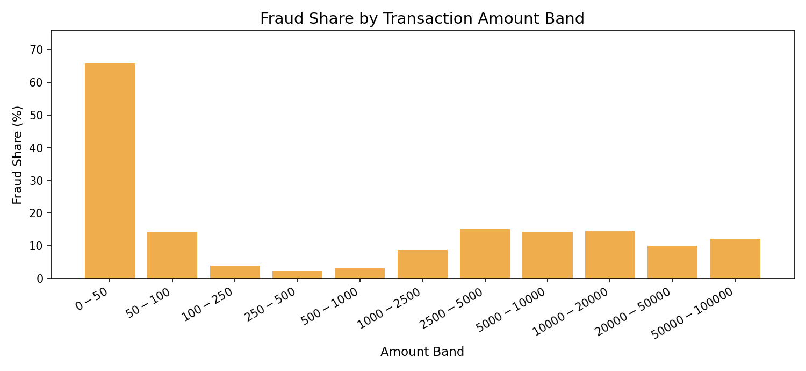
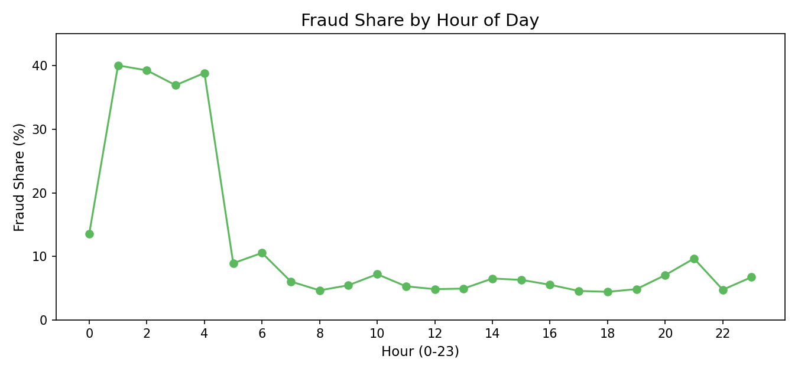
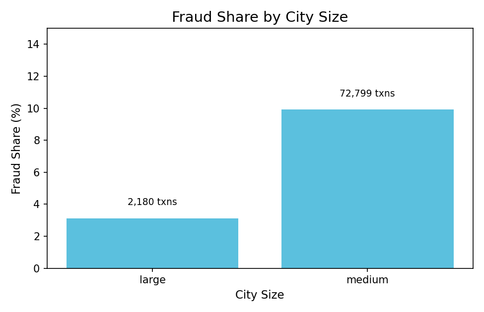
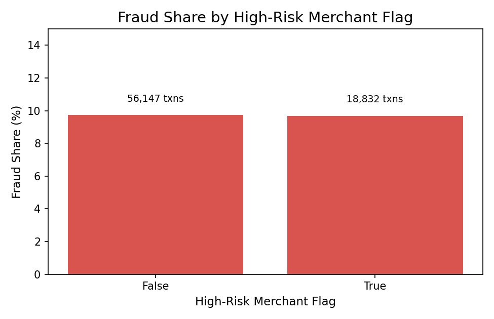

# Fraud Risk Business Review (Oct 2024 Transactions)

This report translates the transaction data into business decisions. It focuses on where risk concentrates, how it shifts by channel, location, time, and amount, and what actions would reduce loss and exposure.

**Executive Snapshot**
- Total transactions: 74,979
- Transactions flagged as fraud: 7,288 (9.7%)
- The highest-risk exposure is concentrated in specific channels, countries, and time windows.

**Channel Risk Concentration**
The chart shows the share of transactions flagged as fraud by channel. In this data, every point-of-sale (POS) transaction is flagged (3,124 transactions), while web and mobile are far lower. This is an immediate control or labeling issue with high business impact.

Why it matters: A single channel driving all flagged activity can mask other risks and distort loss trends.

Decisions to inform:
- Trigger an immediate review of POS processing rules and merchant configurations.
- Add temporary friction or limits to POS transactions until root cause is confirmed.
- Re-check labeling logic for POS to ensure fraud flags reflect real outcomes.

**Geographic Exposure (Top 10 by Volume)**
This chart shows transaction volume by country with fraud counts stacked on top. Brazil, Russia, Mexico, and Nigeria show materially higher fraud counts and shares than peer markets such as the UK, Canada, France, Singapore, Australia, and Japan.

Why it matters: High-volume markets with elevated fraud share drive the largest financial exposure.

Decisions to inform:
- Apply tighter thresholds or step-up verification in high-exposure markets.
- Prioritize regional fraud operations and partner reviews in the riskiest countries.
- Rebalance growth targets based on risk-adjusted volume.

**Amount Bands with Elevated Risk**
The chart shows the share of transactions flagged as fraud by amount band. The smallest transactions ($0-$50) show the highest fraud share, and elevated risk appears again in mid-to-high bands ($2,500-$20,000).

Why it matters: Fraud is not only a large-ticket problem. Micro-transaction abuse can create significant cumulative loss and noise, while high-value bands raise direct financial exposure.

Decisions to inform:
- Add friction for repeated low-value transactions (limits, velocity checks, or step-up prompts).
- Increase scrutiny for mid-to-high value bands where fraud share is elevated.
- Review pricing and fee impacts for high-risk amount ranges.

**Time-of-Day Risk Window**
The chart shows fraud share by hour. The peak risk window is around 01:00, while the lowest risk appears around 18:00.

Why it matters: Risk is time-sensitive, which can guide staffing, alerting, and automated controls.

Decisions to inform:
- Schedule enhanced monitoring and faster intervention during high-risk hours.
- Prioritize real-time rules and automation overnight when risk spikes.

**City Size Exposure**
The chart compares fraud share by city size. Medium-sized cities represent most transactions and carry a materially higher fraud share than large cities.

Why it matters: Risk concentration by city size helps target operational controls and partner oversight.

Decisions to inform:
- Allocate additional review capacity for medium-city transaction flows.
- Tailor merchant enablement or onboarding criteria for medium-city markets.

**High-Risk Merchant Flag Effectiveness**
The chart shows similar fraud shares for transactions flagged as high-risk merchants versus those that are not. The current flag does not separate risk in a meaningful way.

Why it matters: If the flag is not differentiating risk, it can create unnecessary friction and leave real risk unaddressed.

Decisions to inform:
- Revisit the criteria behind the high-risk merchant flag.
- Validate whether the flag reflects current business reality or outdated assumptions.

**What This Enables**
These findings point to concrete business levers: channel controls, geographic risk policies, amount-band guardrails, time-based monitoring, and sharper merchant risk criteria. Together, they can reduce loss, improve operational focus, and support risk-adjusted growth.
