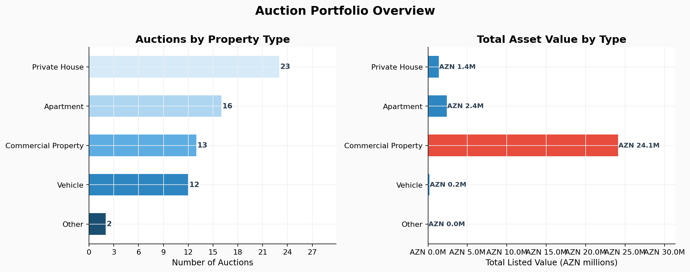
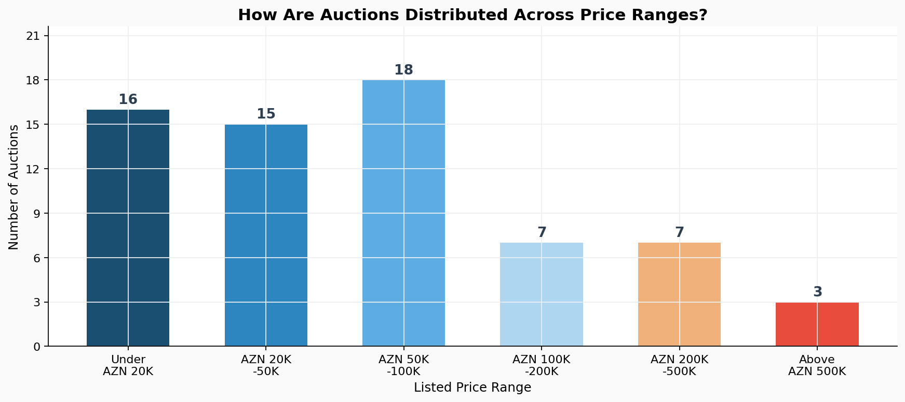
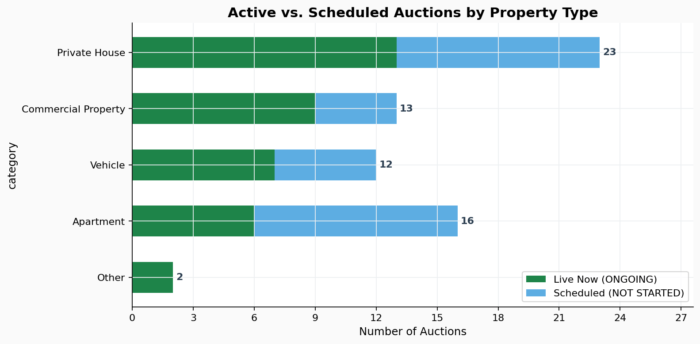
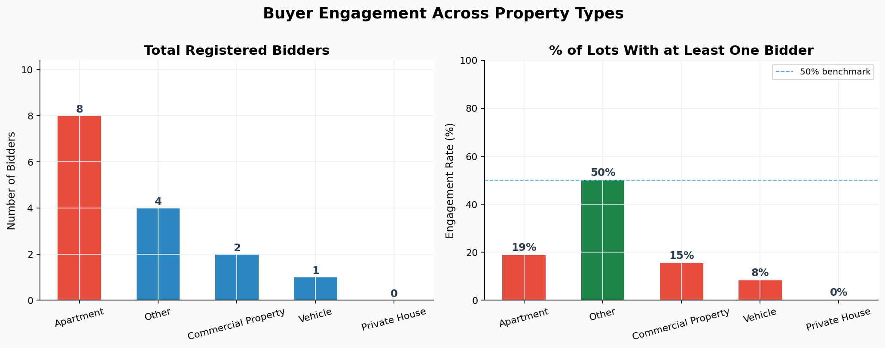
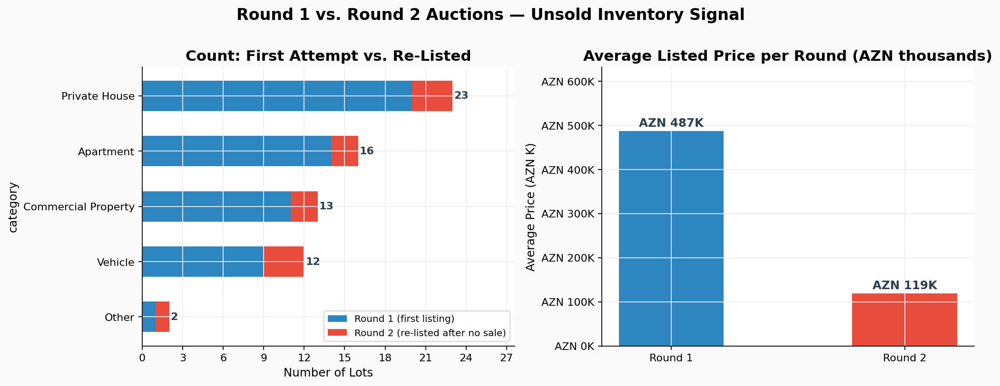
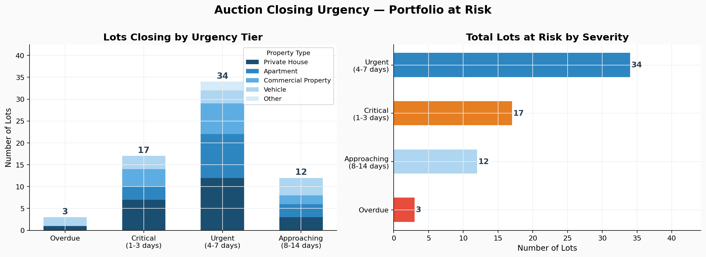
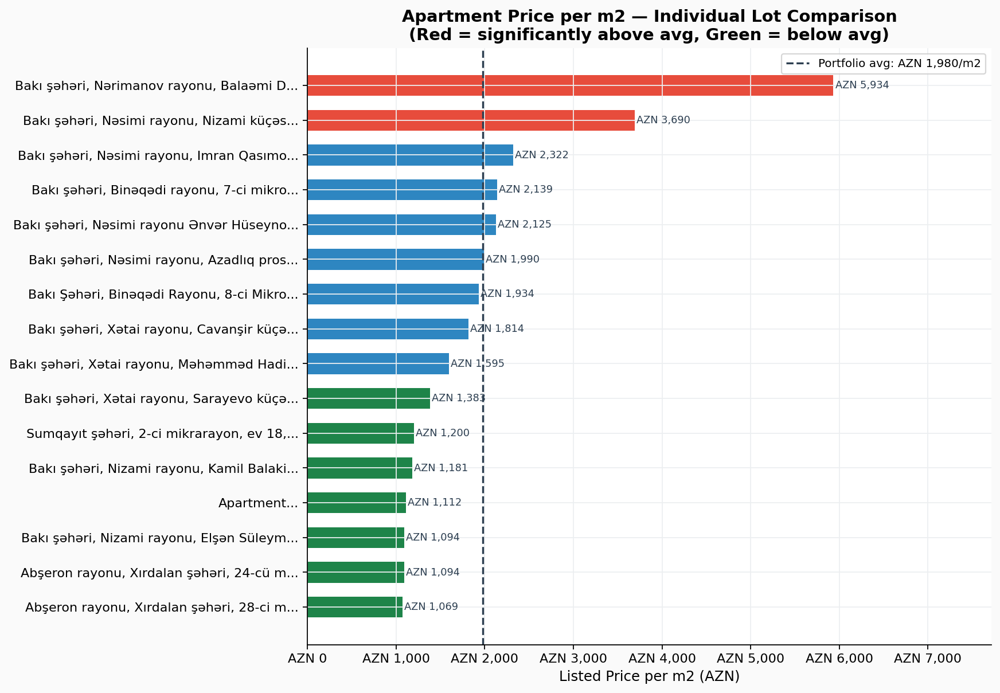

# Herrac.gov.az Auction Portfolio — Business Insight Report

**Data snapshot:** 27 February 2026 · 66 active auctions · Total listed value: AZN 28.5 million

---

## Executive Summary

The current auction portfolio is dominated by residential real estate and is concentrated in the sub-AZN 100K price range. Despite 66 live or scheduled auctions, buyer participation is critically low — fewer than 11% of lots have attracted even a single registered bidder. A significant portion of inventory (17%) is being re-listed for a second time after failing to sell in round one. Immediate attention is needed to improve demand stimulation, pricing strategy, and targeted outreach before further lots expire unsold.

---

## 1. What Is Being Sold?

**What the chart shows:** The left panel counts auctions by property type; the right panel shows the total monetary value each segment represents.

The portfolio consists of five property types. Private houses (23 lots) and apartments (16 lots) together make up nearly 60% of all listings. Vehicles (12 lots) and commercial properties (13 lots) account for the remainder.

However, the **value picture is completely inverted**. Commercial properties represent just 20% of auction count but contain **AZN 24.1 million — over 84% of the portfolio's total listed value**. This concentration is driven by a small number of high-value commercial lots, including one listed above AZN 21 million.

**Business implication:** The portfolio's financial exposure is overwhelmingly concentrated in commercial real estate. A failure to sell even one or two of these lots has a far greater revenue impact than the entire residential segment going unsold. Commercial lots deserve dedicated marketing and buyer outreach beyond the standard auction platform.

---

## 2. How Are Prices Distributed?

**What the chart shows:** The number of auctions falling into each price range, from under AZN 20,000 to above AZN 500,000.

Almost half of all auctions (49 out of 66) are priced below AZN 100,000. This positions the platform primarily as a marketplace for affordable assets. Only 3 lots are listed above AZN 500,000 — yet these account for a disproportionate share of total portfolio value.

**Business implication:** The platform has a strong volume base in accessible price points, which should attract a broad buyer base — provided awareness and trust are built. The upper price tiers require a different acquisition strategy, likely involving institutional or business buyers rather than individual buyers.

---

## 3. How Much of the Portfolio Is Live Right Now?

**What the chart shows:** For each property type, how many auctions are currently live ("ONGOING") versus scheduled to start ("NOT STARTED").

37 out of 66 auctions are currently live and accepting bids. The remaining 29 are scheduled but not yet open. Vehicles have the highest proportion of live auctions. Apartments and private houses have a roughly equal split of live and upcoming lots.

**Business implication:** There is a pipeline of 29 upcoming auctions that need pre-launch promotion. Buyers who are researching today should be made aware of upcoming listings to maximise participation when they open. Email or notification-based alerts for scheduled lots would directly address this gap.

---

## 4. Where Are the Buyers?

**What the chart shows:** The left panel shows the total number of registered bidders across all lots in each category. The right panel shows what percentage of lots in each category have at least one registered bidder.

This is the most critical finding in the entire dataset. **59 out of 66 lots (89%) have zero registered bidders.** Apartments have attracted the most interest (8 total bidders across 16 lots), but even here only a fraction of listings have any participation. Private houses — the largest category — have zero bidder registrations.

The right panel shows engagement rates well below 50% across every category, indicating a systemic demand-side problem, not a pricing issue specific to any one property type.

**Business implication:** The platform is not converting visitors into active participants. Possible causes include limited awareness, friction in the registration process, lack of trust, or insufficient marketing reach. Solving this is the single highest-priority action: even doubling the engagement rate from 11% to 22% would significantly improve sale outcomes and revenue.

---

## 5. How Much Inventory Is Being Re-Listed?

**What the chart shows:** The left panel compares how many lots are in their first listing versus being re-listed (Round 2). The right panel compares the average price between the two rounds.

11 lots (17% of the portfolio) are in their second auction round, meaning they failed to attract a buyer during their first listing. Private houses account for the highest number of re-listed properties. The average price of Round 2 lots (≈AZN 119K) is lower than Round 1 (≈AZN 487K), suggesting these are mid-range assets.

**Business implication:** Re-listed inventory is a direct signal that the first auction failed — usually due to insufficient buyer interest, unrealistic pricing, or poor visibility. Each re-listing cycle delays revenue collection and increases administrative overhead. A structured review of pricing and a targeted re-marketing campaign for Round 2 lots should be conducted before they expire again.

---

## 6. Which Auctions Are About to Close?

**What the chart shows:** All lots closing within the next 14 days, sorted by days remaining. Red bars indicate lots closing within 3 days; blue bars within 7 days.

Several lots are expiring imminently — some have already passed their closing date (shown as negative days). For these, immediate action is required: either close the auction, extend the deadline, or begin the re-listing process. A cluster of lots across all categories will close within the next 7 days.

**Business implication:** Auctions that close without a buyer represent a complete loss of the listing cycle and delay asset monetisation. For lots with 3 or fewer days remaining and no bidders, a short-term extension or urgent targeted outreach (to known interested buyers in that asset class) could still convert a sale. This chart should be reviewed daily as a live operational dashboard.

---

## 7. What Is the Real Cost of an Apartment?

**What the chart shows:** Each apartment listed on the platform, ranked by its price per square metre. The dashed line shows the portfolio average of AZN 1,980 per m².

There is a wide spread in value across apartment listings — from AZN 1,069/m² at the most affordable end to AZN 5,934/m² at the high end. The outlier at the top of the chart is priced nearly three times the portfolio average, which may reflect a premium location or a listing that requires pricing review.

**Business implication:** Buyers comparing apartments on price alone may overlook value differences driven by location, floor, or size. Highlighting price per m² as a standard metric on the platform would help buyers make more informed decisions and could increase engagement. For the highest-priced lots that remain without bidders, a pricing benchmark review against comparable market transactions is advisable.

---

## Summary of Recommended Actions

| Priority | Action | Impact |
|----------|--------|--------|
| **Critical** | Launch a buyer acquisition and awareness campaign | Addresses 89% zero-engagement rate |
| **Critical** | Review lots expiring within 3 days — extend or escalate | Prevents total loss of listing cycle |
| **High** | Dedicated outreach for commercial properties | Protects AZN 24M+ in portfolio value |
| **High** | Audit Round 2 lots for pricing alignment | Reduces re-listing cycle losses |
| **Medium** | Implement pre-launch notifications for upcoming auctions | Builds pipeline awareness |
| **Medium** | Add price-per-m² display to apartment listings | Improves buyer decision quality |

---

*Report generated from live auction data on 27 February 2026. Data sourced from the Herrac State Auction Platform (herrac.gov.az).*
